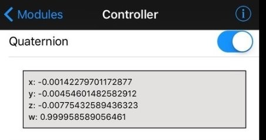
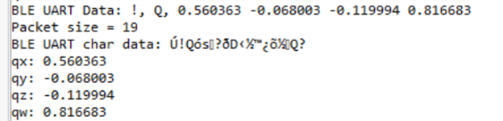
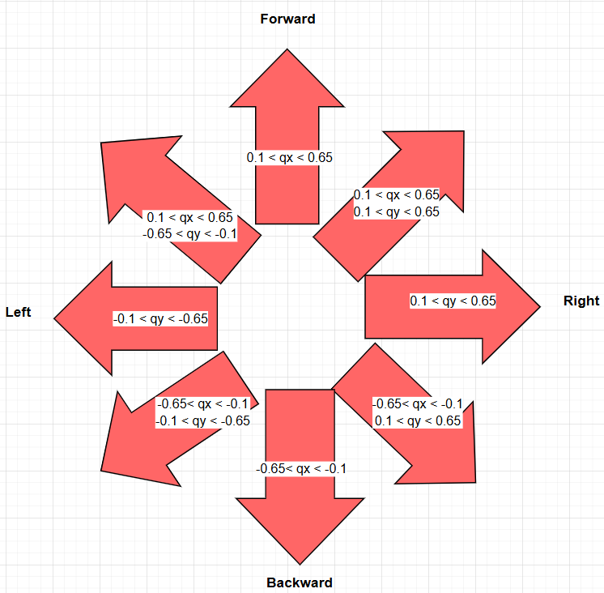

# Tilt/Gesture Controlled Robot

## Introduction
This is the final project assignment for ECE 528/ECE528L Fall 2025 at California State University, Northridge

Designed By:
- Prachi Patel
- Sean Felker

Professor:
- Aaron Nanas

## Objective
Advancement in human machine interaction technologies allow human to communicate more effectively with robot and electrical devices. This project main goal is to design a sensor based hand gesture controlled robot that responses the user’s physical hand movement or tilting of a smartphone, which enables motions such as forward, backward, left, right, or diagonal without using traditional input devices such as remote or joysticks. The smartphone has built-in motion and orientation sensor that provide quaternion reading through BluefruitConnect app. This quaternion sensor readings transmit to Adafruit bluefruit LE UART module wirelessly and then the bluefruit LE UART module will transmit that received reading to the MSP432P401R microcontroller via UART serial communication. The MSP432P401R microcontroller drive the robot to desired direction by adjusting PWM signals accordingly the data that received. The additional feature included is the speed control mode which controls speed of the motor depending on how much the smartphone is tilted. 

## Block Diagram

## Table of Components

|  |  |  |
| --- | --- | --- |
| **Description** | **Quantity** | **Manufacturer** |
| MSP432 LaunchPad | 1 | Texas Instruments |
| USB-A to Micro-USB Cable | 1 | N/A |
| TI-RSLK MAX Chassis | 1 | Pololu |
| Adafruit BLE UART Module | 1 | Adafruit |
| Jumper Wires | 6 | N/A |
| iOS Smartphone | 1 | Foxconn, Pegatron |
| 3.3 V DC Power Supply | 1 | Texas Instruments |

## Table of Pinouts

- Pins for Motor and RGB LED:

|  |  |  |
| --- | --- | --- |
| **Pin Label** | **Connection** | **Purpose** |
| P2.0, P2.1, P2.2 | Direct to MSP432 LaunchPad | RGB LED to indicate command status |
| P2.6 | Direct to MSP432 LaunchPad | Right motor PWM |
| P2.7 | Direct to MSP432 LaunchPad | Left motor PWM |
| P3.6 | Direct to MSP432 LaunchPad | Right motor sleep |
| P3.7 | Direct to MSP432 LaunchPad | Left motor sleep |
| P5.4 | Direct to MSP432 LaunchPad | Left motor direction |
| P5.5 | Direct to MSP432 LaunchPad | Right motor direction |
| P1.1, P1.4 | Direct to MSP432 LaunchPad | Pushbutton on chassis to switch mode |
| P8.6, P8.7 | Direct to MSP432 LaunchPad | Red Chassis LED lights |
| P8.0, P8.5 | Direct to MSP432 LaunchPad | Yellow Chassis LED lights |

- Adafruit BLE UART Module Pinout:

|  |  |  |
| --- | --- | --- |
| **Adafruit BLE UART Module** | **Connection** | **Purpose** |
| MOD | P1.6 of the MSP432 LaunchPad | To select between the two modes: Command and Data |
| CTS | GND | BLE module can send data back to the microcontroller |
| TX0 | P9.6(PM\_UCA3RXD) | UART transmit pin from BLE to the microcontroller |
| RX1 | P9.7(PM\_UCA3TXD) | UART receive pin into BLE module from the microcontroller |
| VIN | 3.3V | Power supply for BLE module |
| RTS | Not Connected(N/C) | When it is fine to send data to the BLE module, this pin will be low. |
| GND | Ground | Common ground for BLE module |
| DFU | Not Connected(N/C) | To force the BLE module to enter a special firmware update mode |

## Background and Methodology
- GPIO (General Purpose Input / Output) pins are used to indicate the driving status of the robot in directions such as forward, backward, left, and right by turning on the RGB LED in a specific color. It is also used to switch the orientation of the smartphone control mode between vertical and horizontal through pushbuttons on the microcontroller. The chassis lights are also used to indicate which control mode is currently active.
- The PWM (Pulse Width Modulation) signal frequency is 50 Hz and the count value in Up/Down mode is 15000. Speed control of the motor is achieved by varying the PWM signal for a specified drive command of the robot. In this project, the duty cycle used to drive motors was 30%.
- The eUSCI_A module is configured and initialized to enable UART communication between the BLE module and the microcontroller using pins P9.6(PM_UCA3RXD) and P9.7(PM_UCA3TXD).
- The BLE module communicates wirelessly with BluefruitConnect app on an iOS smartphone and receives quaternion sensor data from it. The BLE module then transmits that received data to the microcontroller MSP432 via UART serial communication.
- The quaternion data is sent in 19-byte packets in the format: ['!'] ['Q'] [float x] [float y] [float z] [CRC]
- The MSP432 receives the packet in an array and extracts the quaternion values for x and y.
- Based on the transmitted quaternion readings from the BLE module, the microcontroller controls robot movements such as forward, backward, left, right, and diagonal directions. The RGB LED will also be determined based on which direction the robot is moving. For example, tilting the smartphone forward will cause the robot to drive forward and turn on the green color of the LED.
- Use the on-board push buttons to switch between the user controlling the robot in vertical and horizontal modes.
- An additional separate feature is that the robot will adjust the speed depending on how much smartphone is tilted by using a linear equation to scale a given quaternion reading up to a PWM value.
  
### Quaternion Readings from the Smartphone

### Quartnion Readings Seen on the MSP432

### Direction of the Robot Based on Quaternion Readings (Vertical Mode)

### Robot Picture With Connected BLE Module

## Results
- Robot movement in 8 directions depending on the tilt of the phone
- Vertical mode allows the user to control the robot when holding the phone in a vertical/portrait manner
- Horizontal mode allows the user to control the robot when holding the phone in a horizontal/landscape manner
- Speed control mode allows the user to control the speed of the robot based on how much the phone is being tilted (only works for forward, backward, left, and right).

## Video Demos
- Vertical Mode Demo 1: [Link](https://youtube.com/shorts/mXM_NnY5-LM)
- Vertical Mode Demo 2: [Link](https://youtube.com/shorts/WuCZ3pLZBGE)
- Speed Control Mode Demo: [Link](https://youtube.com/shorts/G9cvtJ8V628)
- Horizontal Control Mode Demo: [Link](https://youtube.com/shorts/uC4DbWXyOzI)
  
